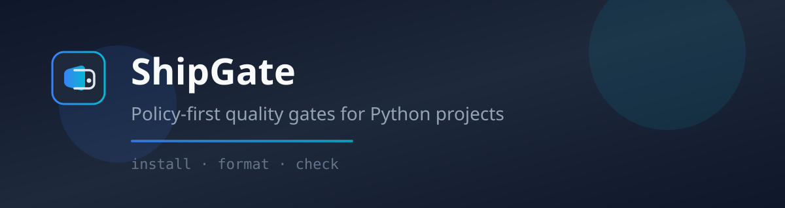

<p align="center">
  
</p>

<p align="center">
  <a href="https://pypi.org/project/shipgate/"></a>
  <a href="https://pypi.org/project/shipgate/"></a>
  <a href="LICENSE"></a>
  <a href="https://inquilabee.github.io/shipgate/"></a>
</p>

<p align="center">
  <strong>One policy, one catalog, three commands — plus refactor.</strong><br/>
  Linters, formatters, scanners, metric gates, and structural Python rules —
  without hand-rolled CI glue.
</p>

<p align="center">
  <a href="https://inquilabee.github.io/shipgate/">Documentation</a> ·
  <a href="https://inquilabee.github.io/shipgate/usage/">Usage guide</a> ·
  <a href="CHANGELOG.md">Changelog</a> ·
  <a href="CONTRIBUTING.md">Contributing</a>
</p>

______________________________________________________________________

You start a Python project and quickly realize you need a pile of tools —
linters, formatters, type checkers, secret scanners — each with its own
config, install story, and CI glue. Before you write much code, you are
maintaining a toolchain.

**ShipGate** replaces that sprawl with one project policy file and a
metadata-driven catalog. Pick a suite once; run the same three commands
locally, in CI, and in pre-commit. The wheel also ships **refactor** — AST
rules for structural cleanup alongside catalog gates.

## Quick start

Requires Python 3.11–3.14 (prefer **3.13** for the full suite).

```bash
pip install shipgate              # or: uv add --dev shipgate
shipgate init                     # scaffold .shipgate/ policy + configs
shipgate install                  # install tools for your suite
shipgate format --target .        # apply formatters
shipgate check --target .         # report-only quality gates
shipgate refactor check .          # structural Python rules (JSON hits)
```

Optional: `pip install 'shipgate[server]'` then `shipgate serve --open` for
the report UI. See [Refactor](https://inquilabee.github.io/shipgate/refactor/)
for `fix`, `list`, `explain`, and optional rule packs.

## Documentation

This README is the shortest path to a working project. For suites, policy,
error formats, CI, gates, and the full tool catalog, use the
[documentation site](https://inquilabee.github.io/shipgate/).

| Guide | Contents |
| --------------------------------------------------------------------- | ----------------------------------------------------------- |
| [Usage](https://inquilabee.github.io/shipgate/usage/) | Commands, suites, error formats, CI, pre-commit |
| [Refactor](https://inquilabee.github.io/shipgate/refactor/) | Structural Python rules (`check`, `fix`, `list`, `explain`) |
| [Configuration](https://inquilabee.github.io/shipgate/configuration/) | Policy files, scopes, Radon metric gates |
| [Tools](https://inquilabee.github.io/shipgate/tools/) | Bundled catalog and project extensions |
| [Architecture](https://inquilabee.github.io/shipgate/architecture/) | Layers and design decisions |
| [Check flow](https://inquilabee.github.io/shipgate/check-flow/) | Tool YAML → `shipgate check` |

## Contributing

See [CONTRIBUTING.md](CONTRIBUTING.md). Maintainer notes live locally in
`AGENTS.md` (not committed).

## License

MIT — see [`LICENSE`](LICENSE).
