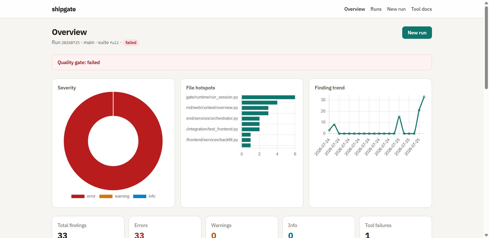

# shipgate

You start a Python project and quickly realize you need a pile of tools —
linters, formatters, type checkers, secret scanners — each with its own
config, install story, and CI glue. Before you write much code, you are
maintaining a toolchain.

**ShipGate is here.** One policy, one catalog, three commands:

```bash
shipgate install
shipgate format
shipgate check
```

## What's in the name?

**Ship** — move code out the door quickly. **Gate** — nothing merges until it
passes the checklist.

ShipGate is fast to set up and especially strong with AI agents: pair
`shipgate` with pre-commit so every commit (human or agent) hits the same
gates. No bad code skips the gate.

## Quick start

### 1. Activate your environment

Use whatever virtualenv or project env you already prefer:

```bash
source .venv/bin/activate
# or: uv sync && source .venv/bin/activate
```

### 2. Install ShipGate from PyPI

```bash
pip install shipgate
# or: uv add --dev shipgate
```

The wheel also includes the standalone `refactor` package and CLI
(`refactor` / `python -m refactor`). Optional report UI extras:
`pip install 'shipgate[server]'`.

Requires Python 3.11–3.14 (prefer **3.13** for the full suite; Semgrep does not
support 3.14 yet).

### 3. Initialize project policy

```bash
shipgate init
# or: shipgate init pyproject
```

This scaffolds everything needed to run the gates: `.shipgate/shipgate.yaml` (or
`[tool.shipgate]`), plus `.shipgate/configs/`, `.shipgate/catalog/`,
`.shipgate/gates/`, and cache metadata.

### 4. Install suite tools

```bash
shipgate install
```

Downloads and wires the tools for your configured suite (`env: managed` keeps
them under `.shipgate/tools/`).

### 5. Hook up pre-commit (optional)

Add a local hook that runs ShipGate on commit, then install hooks:

```yaml
# .pre-commit-config.yaml
repos:
  - repo: local
    hooks:
      - id: shipgate-format
        name: shipgate format
        entry: shipgate format --target .
        language: system
        pass_filenames: false
      - id: shipgate-check
        name: shipgate check
        entry: shipgate check --target .
        language: system
        pass_filenames: false
```

```bash
pre-commit install
```

### 6. Run the report UI (optional)

```bash
pip install 'shipgate[server]'
shipgate serve --open
```

Browse suite runs and findings at `http://127.0.0.1:8765/`.



## Check example

Report-only quality run (does not rewrite files). Success is silent; failures
exit `1`, print findings, and write under `.shipgate/reports/`.

**Error format is configurable.** Set `error-format` in `.shipgate/shipgate.yaml`
(or `[tool.shipgate]`), or override per run with `--error-format`. Built-ins:
`compact`, `text`, `log`, `json`, and `github` (PR annotations).

```bash
shipgate check --check ruff.lint --target app.py --error-format compact
```

Example failure output (`compact`):

```text
app.py:1: error: E401 Multiple imports on one line
app.py:1: error: I001 Import block is un-sorted or un-formatted
app.py:1: error: F401 `os` imported but unused
app.py:1: error: F401 `sys` imported but unused
app.py:3: error: E302 Expected 2 blank lines, found 1
app.py:3: error: E201 Whitespace after '('
app.py:3: error: E202 Whitespace before ')'
app.py:4: error: E111 Indentation is not a multiple of 4
app.py:4: error: F841 Local variable `unused` is assigned to but never used
app.py:5: error: E111 Indentation is not a multiple of 4
app.py:5: error: E201 Whitespace after '('
app.py:5: error: E202 Whitespace before ')'
app.py:6: error: E111 Indentation is not a multiple of 4
app.py:6: error: E226 Missing whitespace around arithmetic operator
```

Same findings as `text`:

```bash
shipgate check --check ruff.lint --target app.py --error-format text
```

```text
[ruff.lint]
- [error] E401: Multiple imports on one line (app.py:1)
- [error] I001: Import block is un-sorted or un-formatted (app.py:1)
- [error] F401: `os` imported but unused (app.py:1)
- [error] F401: `sys` imported but unused (app.py:1)
- [error] E302: Expected 2 blank lines, found 1 (app.py:3)
- [error] E201: Whitespace after '(' (app.py:3)
- [error] E202: Whitespace before ')' (app.py:3)
- [error] E111: Indentation is not a multiple of 4 (app.py:4)
- [error] F841: Local variable `unused` is assigned to but never used (app.py:4)
- [error] E111: Indentation is not a multiple of 4 (app.py:5)
- [error] E201: Whitespace after '(' (app.py:5)
- [error] E202: Whitespace before ')' (app.py:5)
- [error] E111: Indentation is not a multiple of 4 (app.py:6)
- [error] E226: Missing whitespace around arithmetic operator (app.py:6)
```

```bash
shipgate check
shipgate check --suite security
shipgate check --target src
shipgate check --error-format github   # CI / PR annotations
```

## Format example

Apply formatters / autofix tools from the `format` suite (success is silent):

```bash
shipgate format --target .
```

When files need formatting, a report-only format check surfaces the drift:

```bash
shipgate check --check ruff.format --target app.py --error-format compact
```

```text
ruff.format: error: TOOL_EXIT Would reformat: app.py
1 file would be reformatted
```

With `--display-cli`, ShipGate prints the tool command it runs:

```bash
shipgate format --check ruff.format --target . --display-cli
```

```text
ruff.format: .shipgate/tools/python/bin/ruff format --config .shipgate/configs/ruff.toml .
```

## Features

- **Policy-first** — suite, scopes, and thresholds in `.shipgate/` or
  `[tool.shipgate]`; catalog metadata owns how each tool runs
- **Three verbs** — `install`, `format` (writes), `check` (report-only)
- **Suites** — named checklists instead of hand-rolled CI scripts
- **Quiet success** — exit `0` with no noise; structured failures otherwise
- **Managed tools** — optional installs under `.shipgate/tools/`
- **Gitignore-aware** path delivery
- **Extensible** project-local catalog entries and policy gates
- **Report UI** via `shipgate[server]`

## Docs

| Doc | Contents |
| --- | --- |
| [Usage guide](docs/usage.md) | Suites, config, error formats, CI, gates, tools |
| [Radon metric gates](docs/usage.md#radon-metric-gates) | MI/CC thresholds, p5/p10/p95, calibrate |
| [Architecture](docs/architecture.md) | Layers and design decisions |
| [Check flow](docs/check-flow.md) | Tool YAML → `shipgate check` |

## Contributing

See the [contributing guide](CONTRIBUTING.md). Maintainers: [AGENTS.md](AGENTS.md).

## License

See [`LICENSE`](LICENSE).
