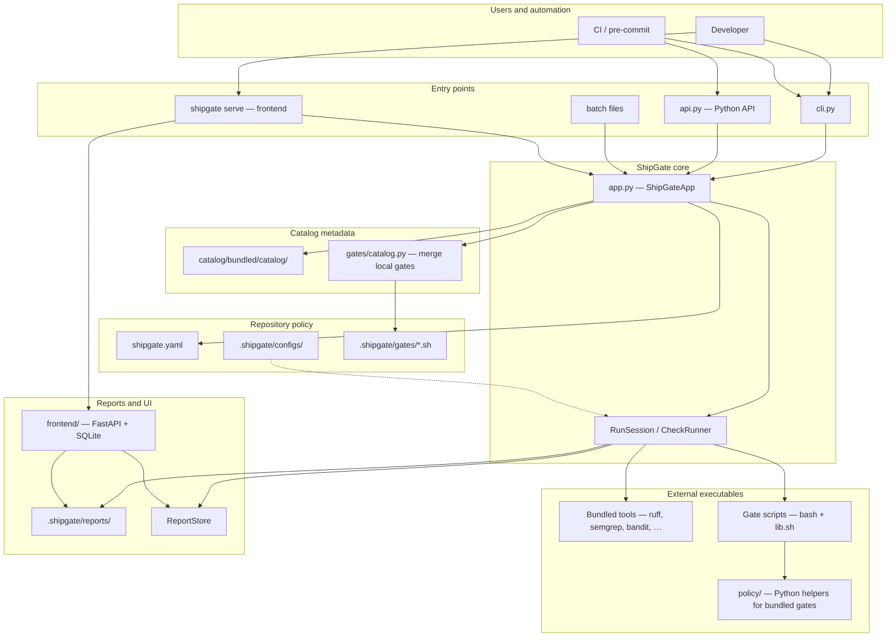
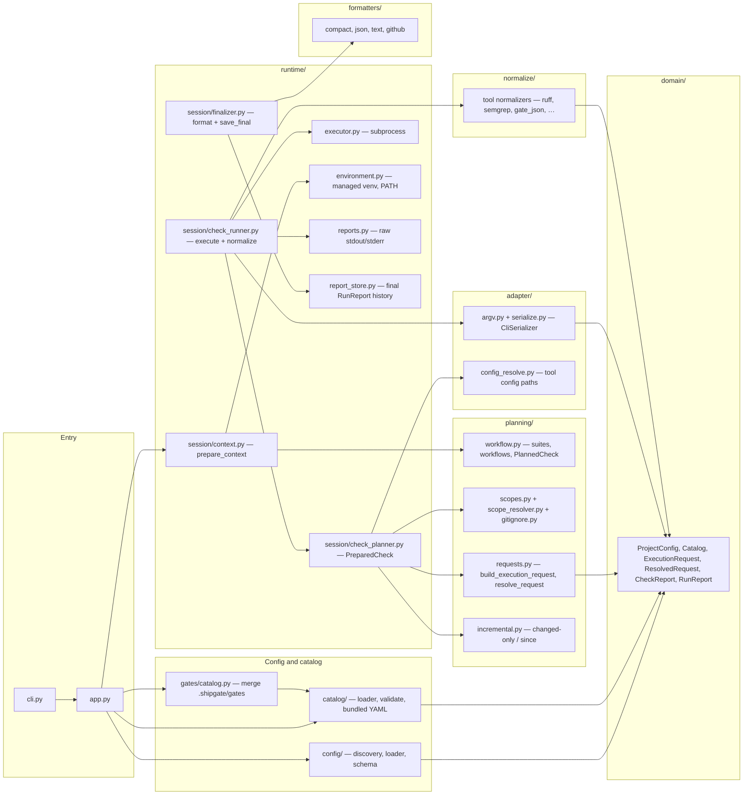
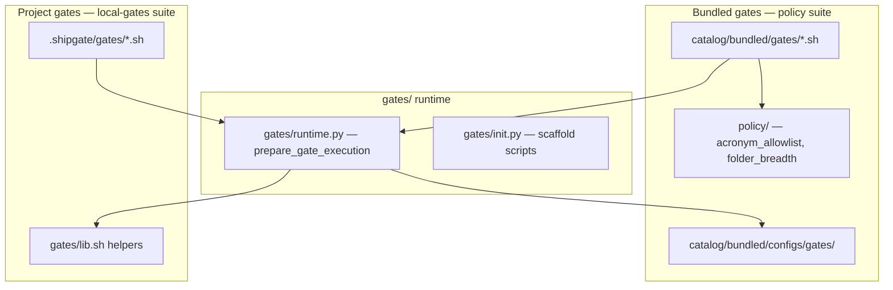
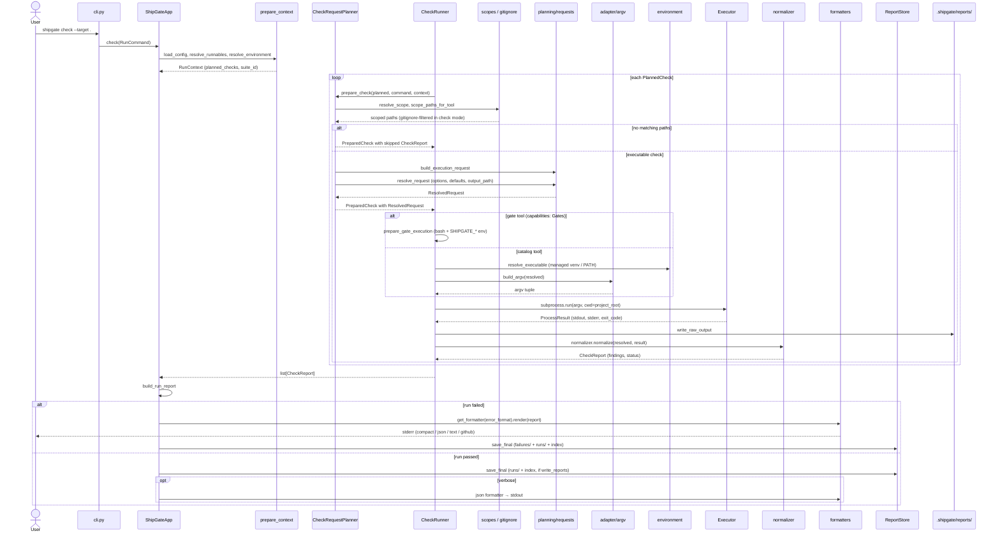
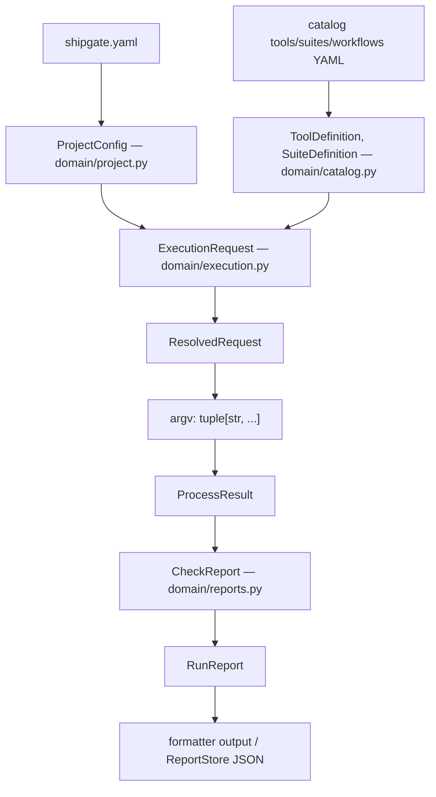

# ShipGate architecture diagrams

Visual companion to `docs/sdd.md` and `docs/implementation.md`. Diagrams reflect the current codebase, not planned features.

## High level — system context

ShipGate sits between repository policy and external quality tools. Projects declare intent in `shipgate.yaml`; ShipGate loads bundled catalog metadata, plans runs, executes tools, and produces canonical reports.

Developers and CI invoke ShipGate through the CLI, Python API, or batch files. `ShipGateApp` loads project config and catalog metadata (including discovered local gates), then delegates suite runs to `RunSession`. External tools and gate scripts perform the actual checks; results land in `.shipgate/reports/` and can be browsed via `shipgate serve`.

## Mid level — layer flow for `check` / `format`

A `check` or `format` run follows the same pipeline; only `RunMode` (`check` vs `apply`) and which catalog tools participate differ. Layers are one responsibility each — see `.cursor/rules/architecture.mdc`.

`cli.py` parses flags into `RunCommand` and calls `ShipGateApp.check` or `.format`. `prepare_context` loads config, resolves the suite or workflow into `PlannedCheck` items, and builds the execution environment. `CheckRequestPlanner` converts each planned check into a skipped `CheckReport` or a `ResolvedRequest`; `CheckRunner` executes argv, writes raw output, and normalizes results. Finalizers persist history through `ReportStore.save_final` and format failures via `formatters/` (successes stay quiet unless `--verbose`).

### Gates and policy (cross-cutting)

Bundled policy gates are shell scripts backed by Python helpers in `policy/`. Project-local gates under `.shipgate/gates/` are discovered at runtime and merged into the catalog as `gate.<name>` tools in the `local-gates` suite. Both paths use `gates/runtime.py` to set `SHIPGATE_*` environment variables and emit JSON for the `gate_json` normalizer.

## Detailed — single check execution

Sequence for one `PlannedCheck` inside `prepare_check` → `execute_check` (`runtime/session/check_planner.py`, `check_runner.py`).

`prepare_check` applies project `scopes`, per-check overrides, `.gitignore` filtering (check mode), and optional incremental (`--changed-only`, `--since`) trimming, then either returns a skip report or a `ResolvedRequest`. `CheckRunner` owns argv execution, raw output, and normalization. `ReportStore.save_final` owns final report persistence: failed runs write `.shipgate/reports/failures/<run_id>/report.json` and set `report_path`, and every completed run is indexed under `.shipgate/reports/runs/`.

### Data objects at layer boundaries

`ExecutionRequest` is the internal API (ADR-002): CLI, Python API, batch files, and the frontend orchestrator all converge on the same types before planning and execution diverge per tool.

## Related docs

- Design narrative: `docs/sdd.md` (especially §9 Execution pipeline)
- File-level guide: `docs/implementation.md`
- Layer rules: `.cursor/rules/architecture.mdc`
- ADR index: `docs/adr-support.md`
