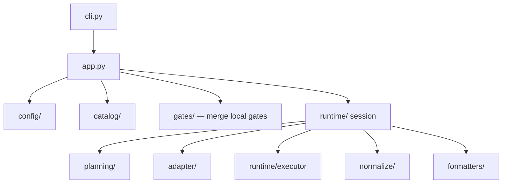

# ShipGate architecture

Repo-policy-first quality orchestration. Projects declare intent; ShipGate runs tools through catalog metadata, Execution Requests, and canonical reports.

Consumer usage (suites, config, CI, tools): [Usage](usage.md),
[Configuration](configuration.md), [Tools](tools.md).\
Tool YAML → `shipgate check` walkthrough: [Check flow](check-flow.md).

## Vision

ShipGate sits between repository policy and external tools (linters, scanners, formatters, project gates). Projects say _what_ should run; the catalog says _how_ each tool is invoked. Tools still do the work.

Ready by default means opinionated and strict, not loose. Suites group tools; there is no separate workflow or capability catalog.

## Layers

```text
domain/ → config/ → catalog/ → planning/ → adapter/ → runtime/ → normalize/ → formatters/
                                                                         → app.py → cli.py
```

| Package | Responsibility |
| ------------------- | ----------------------------------------------------------- |
| `domain/` | Frozen types: project, catalog, options, execution, reports |
| `config/` | Project policy discovery and loading |
| `catalog/` | Bundled tool/suite YAML, validation, load |
| `planning/` | Suite expansion, scopes, Execution Request resolution |
| `adapter/` | Resolved request → argv |
| `runtime/` | Executor, install, environment, reports, session |
| `normalize/` | Tool output → canonical `CheckReport` |
| `formatters/` | Canonical report → human/CI text |
| `gates/` | Script-gate runtime and local-gate discovery |
| `app.py` / `cli.py` | Orchestration and argparse entry |

| Parallel package | Responsibility |
| ---------------- | ------------------------------------------------------ |
| `policy/` | Bundled `PolicyGate` modules (`module:` catalog tools) |
| `frontend/` | Report UI; reads canonical reports only |
| `project/` | `init` / scaffold / project Python helpers |
| `registries/` | Shared ID registries |
| `core/` | Shared process/path utilities |
| `plugins/` | Deferred stub (Decision 005) |

Policy stays out of argv details. Catalog metadata owns flags, config discovery, and normalizer binding. No tool-specific branches in planner, adapter, or executor.

## Scoping and ignores

ShipGate resolves check paths through gitignore-aware scoping ([`planning/utils/gitignore.py`](https://github.com/inquilabee/shipgate/blob/main/src/shipgate/planning/utils/gitignore.py)) before building argv. Prefer that single source of truth over duplicating exclude lists in every bundled tool config.

Bundled per-tool excludes remain only when the tool **also** walks trees itself outside ShipGate's path list (for example Bandit's `exclude_dirs` in `configs/bandit.yaml`). Tools that only see the paths ShipGate passes (yamlfmt notes this in its config header) should not grow parallel ignore YAML.

Project pain belongs in `.shipgate/configs/` or `.shipgate/allowlists/`, not in portable bundled catalog defaults.

## Decisions

### Decision 001: keep policy separate from execution

Project config describes intent (suite, scopes, thresholds). Command flags, recursion, and install paths belong in the catalog and runtime.

### Decision 002: Execution Request is the internal API

CLI, Python API, and CI all produce the same Execution Request. Runtime does not care how the request was started.

### Decision 003: tools and suites are runnables

A tool runs one external executable. A suite expands to tools (and nested suites). Groups like `security` and `full` need no special execution path.

### Decision 004: normalize before formatting

Normalizers convert tool output to canonical ShipGate JSON. Formatters consume only that shape.

### Decision 005: catalog first, public plugins later

Bundled catalog entries, configs, and normalizers are the extension surface until those contracts are stable enough for a public plugin API.

### Decision 006: ship opinionated defaults

A conventional repo should get a high-signal gate after `init` / `install` without hand-tuning every tool. Project config overrides policy; it is not required to make the product usable.

### Decision 007: keep the product UX, metadata-driven internals

Small command set (`install`, `update`, `format`, `check`), managed installs, quiet success, structured failures. Tool behavior lives in declarative Tool Definitions, not hardcoded runtime branches.

### Decision 008: seed the catalog from proven tools

Bundled tools start from the useful set proven in earlier work (Ruff, ty, Bandit, Semgrep, Gitleaks, and the rest of the current catalog). Extend via Tool Definition YAML + config + normalizer.

### Decision 009: report frontend on canonical JSON

A local report UI may browse runs and findings, but it must read canonical reports, not raw tool output. CLI and report schema come first.

## Package view



For how a Tool Definition becomes argv and a report, including `shipgate check`, `--suite`, and `--check` examples, see [Check flow](check-flow.md).
