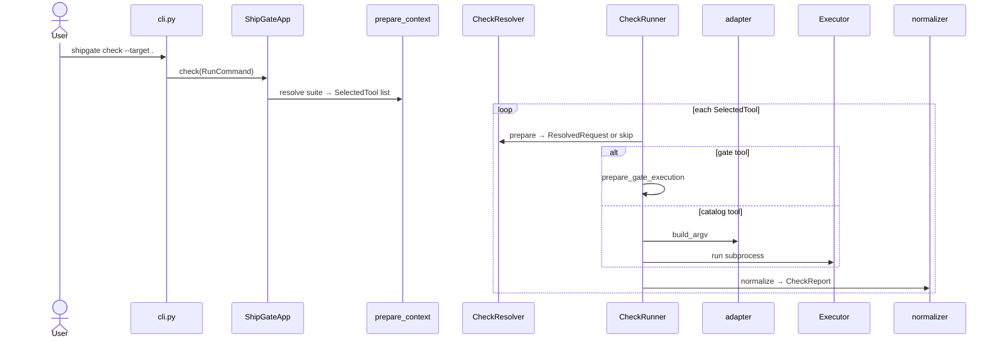

# From tool definition to `shipgate check`

How a catalog tool YAML becomes a real subprocess when you run ShipGate.

Architecture overview: `docs/architecture.md`. Option flag map: `docs/res/config.md`.

## What a tool definition is

Each file under `src/shipgate/catalog/bundled/catalog/tools/` (and optional overlays in `.shipgate/catalog/tools/`) describes one check id: executable, fixed flags, how options map to CLI flags, where config is discovered, which paths to pass, and which normalizer reads the output.

ShipGate does not hardcode per-tool argv in the planner or executor. The YAML is the contract.

Suites (`catalog/suites.yaml`, or `.shipgate/catalog/suites.yaml`) are named lists of those tool ids (suites may nest).

## End-to-end flow

```text
tool YAML  →  CatalogLoader  →  ToolDefinition
                                      ↑
shipgate check  →  resolve suite/check  →  SelectedTool
                                      ↓
                         CheckResolver.prepare → PreparedRun → ResolvedRequest
                                      ↓
                         adapter → argv → Executor.run
                                      ↓
                         normalizer → CheckReport
```

1. **Load** — bundled tools (plus project catalog overlays) become frozen `ToolDefinition` objects.
1. **Select** — project `suite:`, `--suite`, or `--check` decides which tool ids run.
1. **Plan** — resolve target/scope, config files, and options for each tool. Scope uses gitignore; see **Scoping and ignores** in `docs/architecture.md`.
1. **Serialize** — catalog metadata + options become argv (no tool-specific branches).
1. **Run** — subprocess; normalizer turns output into a canonical report.

Useful flags while learning: `--display-cli` prints each argv; `--target` narrows the tree.

Script gates are tools with `script` set; runtime uses `gates/runtime.py` instead of normal argv serialization.

## Examples

Assume a project with `.shipgate/shipgate.yaml` (after `shipgate init`) and tools installed (`shipgate install`).

### Default suite check

Uses the suite named in project config (template default is often `full`). Expands nested suites into every leaf tool.

```bash
uv run shipgate check --target .
uv run shipgate check --target . --display-cli
```

Equivalent when the policy says `suite: full`: run everything `full` expands to (`standard`, `security`, `extended`, `policy`, …).

### One suite

`--suite` overrides the project suite for this run. Members can be tools or other suites.

```bash
# Nested: python-quality → ruff.lint, ty.check
uv run shipgate check --suite python-quality --target .

# Security tools as a group
uv run shipgate check --suite security --target . --display-cli

# Formatters (check mode still reports; use `shipgate format` to apply)
uv run shipgate check --suite format --target .
```

List suite names:

```bash
uv run shipgate list suites
```

### One check

`--check` runs exactly one catalog tool id. Suites are ignored for selection.

```bash
uv run shipgate check --check ruff.lint --target src
uv run shipgate check --check gitleaks.scan --target .
uv run shipgate check --check markdownlint.check --target docs --display-cli
uv run shipgate check --check yamllint.check --target .
```

List tool ids:

```bash
uv run shipgate list tools
# or
uv run shipgate list checks
```

### How selection interacts

| Invocation | What runs |
| --- | --- |
| `shipgate check` | Project `suite` (or built-in default), expanded |
| `shipgate check --suite NAME` | That suite only, expanded |
| `shipgate check --check ID` | That single tool |

`--check` wins over suite selection. Project `checks:` bindings (scopes/thresholds) still apply to matching tools when they run.

## What the YAML controls (any tool)

| Field | Effect at runtime |
| --- | --- |
| `executable` / `subcommand` | Leading argv tokens |
| `cli` + `option_order` | How config, format, output, paths become flags |
| `configuration` | Which config files are discovered or fall back to bundled |
| `scope` | Which paths (or root) are passed; extensions matter most for incremental/`--changed-only` |
| `normalizer` | Which parser turns tool output into findings |
| `modes` | Whether the tool may run under `check` and/or `format` (`apply`) |
| `install` | What `shipgate install` puts on PATH / in the managed env |

Project overlays under `.shipgate/catalog/tools/` can replace or `extends:` a bundled tool without editing the package.

## Single-check sequence



Quiet on success; failures go through formatters (`compact`, `json`, `text`, `github`) and land under `.shipgate/reports/`.
